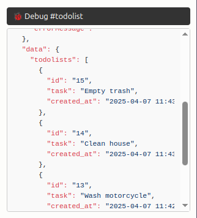

# Aplikasi CRUD Todolist ala Heroic

Heroic hadir dengan membawa plugin JavaScript yang dapat digunakan untuk lebih menyederhanakan pengembangan aplikasi. Ada 3 plugin yang dapat digunakan, diantaranya `$heroic`, `$heroicForm` dan `$heroicHelper`. Detail mengenai masing-masing dapat dilihat di bagian Konsep.

Tutorial ini akan membimbing Anda membuat aplikasi **Todo List** dengan fitur lengkap CRUD (Create, Read, Update, Delete) menggunakan fungsi `$heroic` dan `$heroicForm`. Proses akan dijelaskan secara bertahap agar mudah diikuti.

---

## 1. Buat Tabel Todo di Database

Jalankan query SQL berikut di database Anda untuk membuat table `todolist`:

```sql
CREATE TABLE todolists (
    id INT AUTO_INCREMENT PRIMARY KEY,
    task TEXT NOT NULL,
    created_at TIMESTAMP DEFAULT CURRENT_TIMESTAMP
);
```

Jalankan juga query SQL berikut untuk menambahkan dummy data:

```sql
INSERT INTO `todolists` 
(`id`, `task`) VALUES
(1, 'Wash motorcycle'),
(2, 'Clean house'),
(3, 'Empty trash');
```

> Pastikan Anda sudah melakukan proses [Instalasi Heroic](quickstart.md), dan mengatur konfigurasi koneksi database di project CodeIgniter 4.

---

## 2. Buat Halaman Todo

Buka terminal dan jalankan perintah berikut:

```bash
php spark heroic:createPage todolist
```

Perintah ini akan membuat dua file:

```
app/Pages/todolist/PageController.php
app/Pages/todolist/template.php
```

Anda sudah bisa mengaksesnya di: `http://localhost:8080/todolist`

---

## 3. Tampilkan Data Todo

Di `PageController.php`, tambahkan method berikut:

```php
public function getData()
{
    $db = db_connect();
    $data['todolists'] = $db->table('todolists')
                            ->orderBy('id', 'desc')
                            ->get()
                            ->getResultArray();

    return $this->respond($data);
}
```

Lalu di `template.php`, ubah kodenya menjadi seperti ini:

```html
<div id="todolist" x-data="$heroic({ getUrl: '/todolist/data', title: 'Todo List' })">
    
    <div class="container mt-5">
        <h1>Todo List</h1>
        
        <ul class="list-group">
            <template x-for="(item, index) in data.todolists" :key="item.id">
                <li class="list-group-item" x-text="item.task"></li>
            </template>
        </ul>
    </div>

</div>
```

Cek kembali hasilnya di http://localhost:8080/todolist. Aplikasi todolist akan menghasilkan list todo dari database.

### Penjelasan:

* `template.php` membuat komponen Alpine dengan menambahkan atribut `x-data` yang isinya memanggil fungsi `$heroic()`
* Fungsi `$heroic({})` menerima parameter options berupa object JavaScript, diantaranya nilai `getUrl: '/todolist/data'` yang akan digunakan untuk meminta data ke server dengan url tersebut.
* Request url `'/todolist/data'` akan ditangani oleh halaman todolist class `PageController` method `getData()`.
* `PageController@getData()` mengambil data dari database dan mengembalikannya dalam format JSON sebagai response data (menggunakan `$this->respond()`).
* Semua response data otomatis dapat digunakan di dalam view template oleh Alpine.js melalui prop `data`, seperti `data.todolist`, dsb.

### Debugging

Anda dapat menggunakan directive x-debug pada elemen yang memiliki x-data untuk menampilkan Alpine.js data di dalam debugbar yang akan tampil di kanan bawah halaman.

```html
<div id="todolist" x-data="$heroic({ getUrl: '/todolist/data', title: 'Todo List' })" x-debug>
```



> Pastikan untuk menghapus kembali atribut directive x-debug setelah selesai digunakan.

---

## 4. Menambahkan Data Todo

Kita akan membahas bagaimana cara **menambahkan Todo baru** dengan pendekatan yang *declarative* menggunakan `$heroicForm()` tanpa perlu menulis JavaScript tambahan.


### Siapkan Endpoint di Controller

Pastikan `PageController.php` di folder `app/Pages/todolist` memiliki method berikut:

```php
public function postIndex()
{
    $task = $this->request->getPost('task');

    $db = db_connect();
    $db->table('todolists')->insert([
        'task' => $task
    ]);

    return $this->respond([
        'status' => 'success',
        'message' => 'Task berhasil ditambahkan.'
    ]);
}
```

Method ini akan dapat menerima request ke endpoint _/todolist_ dengan HTTP method `POST`.

### Tambahkan Form di Template

Masukkan kode berikut ke dalam **template.php** setelah judul halaman `<h1>` untuk menampilkan form tambah todo:

```html
<form 
    class="mb-3" 
    x-data="$heroicForm({ 
        postUrl: '/todolist', 
        onSuccess: (result) => {
            reload(); 
            $heroicHelper.toastr(result.message, 'success');
        } 
    })">
    
    <div class="input-group">
        <input type="text" name="task" class="form-control" placeholder="Tambahkan tugas baru..." required>
        <button class="btn btn-primary" type="submit">Tambah</button>
    </div>
</form>
```

#### Penjelasan Konfigurasi
- `postUrl`: Endpoint tujuan saat form disubmit (otomatis pakai method POST)
- `onSuccess`: Fungsi yang dijalankan saat berhasil, di sini kita reload() data dan tampilkan toastr
- `reload()`: Memanggil ulang $heroic() untuk memperbarui daftar data Todo
- `$heroicHelper.toastr()`: Menampilkan notifikasi sukses menggunakan helper bawaan Heroic

Saat tombol Tambah diklik, form akan mengirimkan data ke endpoint `/todolist` dengan method `POST`. Permintaan akan diterima oleh controller method postIndex() dan data akan disimpan ke dalam database. Bila response berhasil, maka sistem akan menjalankan kode di dalam fungsi `onSuccess`.

## 5. Update Todo

Kita akan menambahkan fitur **update/edit Todo** menggunakan pendekatan deklaratif menggunakan `$heroicForm`.

### Siapkan Endpoint di Controller

Pastikan di `PageController.php` tersedia method `putIndex()` berikut:

```php
public function putIndex($id)
{
    $task = $this->request->getRawInputVar('task');

    $db = db_connect();
    $db->table('todolists')->where('id', $id)->update([
        'task' => $task
    ]);

    return $this->respond([
        'status' => 'success',
        'message' => 'Task berhasil diperbarui. - ' . $task
    ]);
}
```

Method ini akan dapat menerima request ke endpoint _/todolist_ dengan HTTP method `PUT`.

### Siapkan Variabel `meta` di `$heroic()`

Di bagian paling atas template, tambahkan properti `meta` di dalam `x-data`:

```html
x-data="$heroic({ 
    url: '/todolist/data', 
    title: 'Todo List',
    meta: {
        id: null,
        task: null
    }
})"
```

Kita membuat properti `id` dan `task` di dalam parameter `meta` untuk menyimpan state selama proses editing. Anda dapat menggunakan parameter meta ini untuk mendeklarasikan properti apapun yang dibutuhkan di aplikasi.


### Tambahkan Form Edit

Letakkan setelah form tambah task:

```html
<div x-show="meta.id" class="mb-3">
    <form x-data="$heroicForm({ 
                putUrl: () => `/todolist/${meta.id}`,
                onSuccess: (res) => { 
                    reload(); 
                    $heroicHelper.toastr(res.message, 'success'); 
                    meta.id = null; 
                }
            })">
        <div class="input-group">
            <input type="text" name="task" x-model="meta.task" class="form-control" required>
            <button class="btn btn-success" type="submit">Update</button>
            <button class="btn btn-secondary" type="button" @click="meta.id = null">Batal</button>
        </div>
    </form>
</div>
```

#### Catatan:

- Parameter `putUrl` digunakan untuk mendefinisikan endpoint url yang akan menerima request data update dengan method `PUT`. 
- Bila ingin menambahkan parameter dinamis pada url, maka tuliskan dalam bentuk fungsi seperti pada contoh.
- CodeIgniter menyediakan fungsi `$this->request->getRawInputVar()` untuk mendapatkan data dari request method selain `GET` dan `POST`.


### Tambahkan Tombol Edit di Tiap Item

Di dalam `x-for` list todo, tambahkan tombol Edit:

```html
<template x-for="(item, index) in data.todolists" :key="item.id">
    <li class="list-group-item d-flex justify-content-between">
        <span x-text="item.task"></span>
        <button class="btn btn-sm btn-outline-primary" @click="meta.id = item.id; meta.task = item.task">
            Edit
        </button>
    </li>
</template>
```

Saat tombol edit diklik, properti `meta.id` dan `meta.task` akan diisi dengan data dari baris todo yang dipilih.
Form edit todo ini akan muncul saat properti `meta.id` memiliki nilai.
Setelah disubmit, data akan dikirim via `PUT` ke controller
Data akan diperbarui, list akan di-*reload*, dan notifikasi sukses akan muncul

---

## 6. Hapus Todo

Kali ini kita akan membahas cara **menghapus Todo** menggunakan `$heroicForm()` yang tetap deklaratif dan rapi tanpa menulis kode JavaScript manual.

---

### Siapkan Endpoint di Controller

Tambahkan method `deleteIndex()` di dalam `PageController.php`:

```php
public function deleteIndex($id)
{
    $db = db_connect();
    $deleted = $db->table('todolists')->delete(['id' => $id]);

    if ($deleted) {
        return $this->respond([
            'status' => 'success',
            'message' => 'Task berhasil dihapus.'
        ]);
    } else {
        return $this->failNotFound('Task tidak ditemukan.');
    }
}
```

Method ini akan dapat menerima request ke endpoint _/todolist_ dengan HTTP method `DELETE`.

### Tambahkan Tombol Hapus di Template

Masih di dalam `x-for`, tambahkan form hapus seperti ini:

```html
<form 
    x-data="$heroicForm({ 
        deleteUrl: () => `/todolist/${item.id}`,
        confirm: true,
        onSuccess: (res) => {
            reload();
            $heroicHelper.toastr(res.message, 'success');
        }
    })"
    class="d-inline">
    <button class="btn btn-sm btn-outline-danger" type="submit">
        Hapus
    </button>
</form>
```

### Penjelasan Konfigurasi

- `deleteUrl`: Endpoint tujuan saat form disubmit (otomatis pakai method `DELETE`)
- `confirm`: Akan memunculkan konfirmasi sebelum melakukan aksi
- `onSuccess`: Fungsi callback yang dijalankan setelah penghapusan berhasil
- `reload()`: Memanggil ulang `$heroic()` untuk memperbarui daftar data Todo

### Hasil Akhir

- Tombol **Hapus** tersedia di tiap item Todo
- Ketika diklik, akan muncul dialog konfirmasi
- Jika disetujui, data akan dikirim ke controller dan Todo akan dihapus
- Daftar akan otomatis diperbarui dan notifikasi sukses muncul

---

### CRUD Todo Selesai!

Dengan tutorial ini, Anda sudah berhasil membangun fitur lengkap:

- [x] Menampilkan daftar Todo (`getData` + `$heroic()`)
- [x] Menambahkan Todo (`postUrl` + `$heroicForm()`)
- [x] Mengedit Todo (`putUrl` + `$heroicForm()` + `meta`)
- [x] Menghapus Todo (`deleteUrl` + `$heroicForm()` + `confirm`)

Heroic benar-benar menyederhanakan pembuatan UI CRUD tanpa perlu menulis JavaScript imperatif.